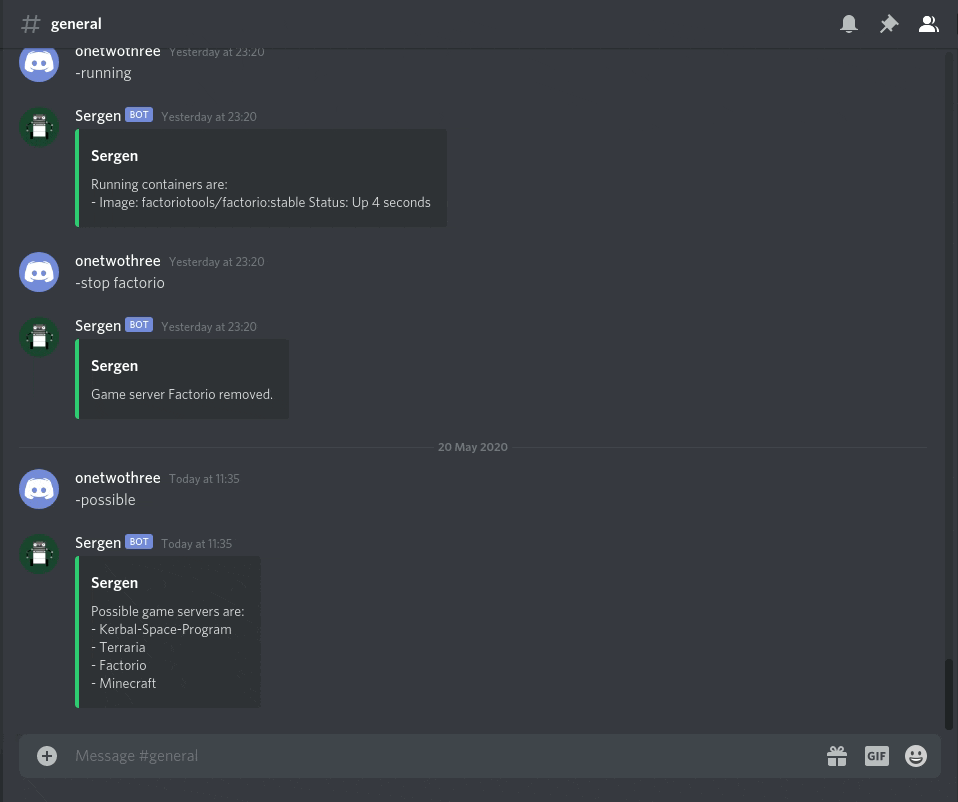

  

# Sergen
This discord bot will create servers that run out of the box. 

Simply typing
`-run Minecraft`
will generate you a server on the latest version of minecraft with a world that is located within /opt/Sergen/serverfiles/{discordserverid}/Minecraft

All the supported images below will work with no issues. There are some work in progress game servers, but I haven't fully tested them so there's no guarantee they'll work.

Try it out here: https://discord.gg/aJpFaS2U

## Supported Servers
* Minecraft Java Edition
* Factorio
* Valheim

If there's any servers you'd desperately like to see, feel free to open an issue.

## Requirements
* Windows/Linux (Not tested on a mac)
* Docker
* Dotnet 6.0 runtime

## Installation
A systemd service is the recommended way to run Sergen. I create and run the service within the install scripts. If you don't want it setup this way, don't use the install scripts.

* Download the latest build from the releases section. Extract it, then run ./Install.sh
* Clone the git repo and run BuildAndInstall.sh

## Setup
You'll need to setup a bot with discord, found here: https://discord.com/developers/applications

Here's an article on how to do it: https://www.howtogeek.com/364225/how-to-make-your-own-discord-bot/ (just do up before the Node.js part)

Get your token and update https://github.com/tomhobson/Sergen/blob/master/src/Sergen.Main/appsettings.json.
Replace PUTBOTTOKENHERE with the token generated from https://discord.com/developers/applications.

You'll need to restart the service and invite your bot, which can be done with this link:
https://discord.com/oauth2/authorize?client_id=123456789&scope=bot

Replace 123456789 with your bot's client id.

## Allowlists
Sergen has allowlist implementation, for if you're running this on a big server and want to make sure only certain users can start and stop servers.

To enable this run:
`-allowlist enable`

To add a user to the allowlist run:
`-allowlist add @discorduser`

Only the server owner will be able to manage the allowlist.

## Troubleshooting

Feel free to open an issue if you're having trouble setting this up, I'll be happy to help.
